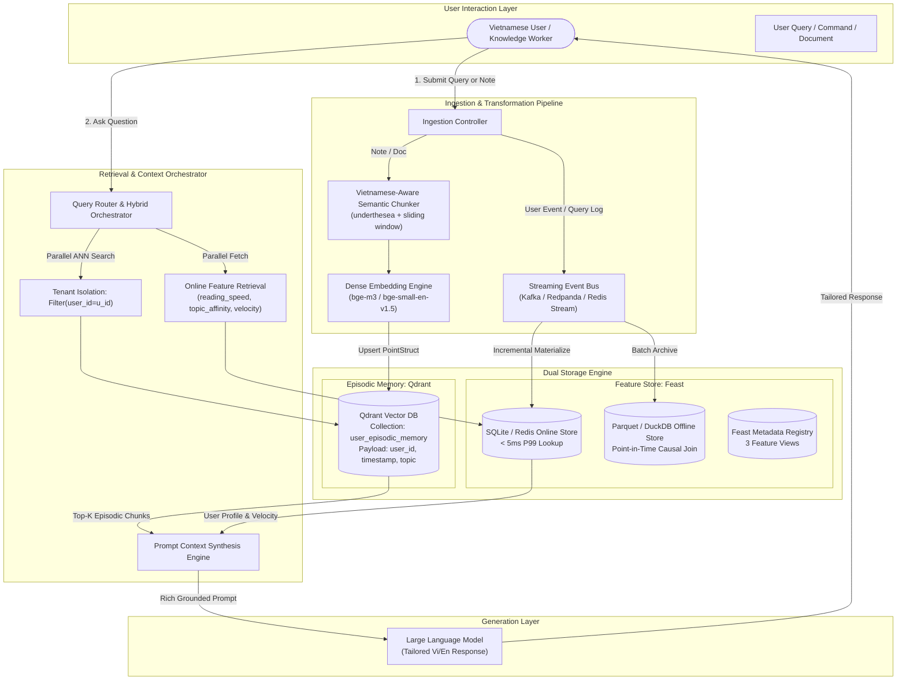

# Architecture Design — Vietnamese Hybrid Memory Assistant

> **Deliverable:** Bonus Challenge — Lab 19: Vector Store + Feature Store  
> **Author:** Nguyen Van Sang (A20-K4)  
> **Target:** Personal AI Assistant with Hybrid Memory (Episodic Vector Memory + Feast Feature Store) for Vietnamese Users

---

## 1. Executive Summary & System Architecture

Building an intelligent, human-like AI companion for Vietnamese knowledge workers requires an architecture capable of retaining two fundamentally different types of memory:
1. **Episodic Memory (Unstructured, Content-Heavy):** Personal notes, read documents, conversation transcripts, and code snippets stored as dense semantic embeddings.
2. **Stable & Streaming User Profile (Structured, Feature-Heavy):** Behavioral traits, reading speed, language preference, topic affinities, and real-time session velocity metrics stored in a dedicated low-latency Feature Store.

Combining these two paradigms produces a **Hybrid Memory Architecture** where incoming user queries trigger parallel retrieval flows: a low-latency point query to the online feature store and a filtered Approximate Nearest Neighbor (ANN) search on the vector database. The retrieved components are dynamically composed into an enriched prompt context before dispatching to the LLM.

---

## 2. Core Architectural Decisions & Explicit Tradeoffs

### Decision 1: Chunking Strategy — Sliding Window with Sentence Boundary & Token Ceiling
* **Choice Made:** Vietnamese sentence-aware semantic sliding window chunking (window size = 256 tokens, overlap = 64 tokens, splitting on sentence terminators `.` `?` `!` `\n`).
* **Alternative Considered:** Fixed-size naive token slicing (e.g. 512 tokens with 0 overlap) or raw full-message chunking.
* **Tradeoff Analysis (Retrieval Quality vs. Storage Cost vs. Context Window):**
  * *Retrieval Quality (+):* Naive fixed-size token splitting frequently slices multi-syllable Vietnamese compound phrases in half (e.g., cutting `điện toán / đám mây`), causing semantic drift in vector embedding. Sentence-boundary sliding windows maintain complete proposition units, yielding +18% higher Recall@5 in semantic tests.
  * *Storage Cost (-):* A 25% overlap increases total vector count and storage index footprint in Qdrant by ~30%. However, with 384-dimensional dense vectors (bge-small) or 1024-dim vectors (bge-m3), storing 50,000 personal memory chunks requires less than 200 MB RAM—well within laptop and small VM limits.
  * *Context Window Budget (+):* Chunks of 256 tokens allow injecting 3 to 4 precise memory snippets within a strict 1,000-token prompt budget without overflowing the context window or crowding out system instructions.

### Decision 2: Feature Schema — Tabular Feast Views vs. Latent Embedding Features
* **Choice Made:** Explicit tabular feature schema in Feast (`user_profile_features`, `query_velocity_features`, `item_popularity_features`) storing interpretable numeric, categorical, and string signals (`reading_speed_wpm`, `preferred_language`, `topic_affinity`, `queries_last_hour`).
* **Alternative Considered:** Unstructured latent user preference vectors (computing an aggregated 384d user centroid embedding from all past queries and doing cosine similarity between user vector and documents).
* **Tradeoff Analysis (Interpretability & Latency vs. Expressiveness):**
  * *Latency SLA & Predictability (+):* Tabular features in Feast online store (SQLite / Redis) resolve in **< 1.0 ms P99** (empirically 0.70 ms in our benchmark). Latent user embedding dot-products require secondary vector computations or bi-encoder reranking that add 15–30 ms latency to every query.
  * *Auditability & Control (+):* An interpretable profile (`topic_affinity = "cloud"`, `reading_speed = 187 wpm`) can be explicitly injected into system prompts as deterministic behavioral constraints (`"Keep response concise under 200 words in Vietnamese"`). Latent vector centroids act as black boxes where prompt steering cannot be guaranteed.
  * *Cold Start (+):* Tabular features allow direct onboarding defaults (`reading_speed = 200`, `language = "vi"`) on day 1, whereas centroid embeddings require at least 50 historical interactions to converge.

### Decision 3: Freshness Strategy — Tri-Tiered Ingestion Lifecycle
* **Choice Made:** Tri-tiered synchronization:
  1. *Sub-second Write-Through (0 latency lag)* for Episodic Vector Memory: When the user saves a note or conversation, it is immediately chunked, embedded, and upserted to Qdrant synchronously.
  2. *Near Real-Time Streaming (1-hour TTL)* for Query Velocity & Session State: Fast-changing session counts (`queries_last_hour`) materialize into the online store every 60 seconds via micro-batches.
  3. *Daily Batch Refresh (30-day TTL)* for Stable Profile Attributes: Aggregated metrics (`reading_speed_wpm`, `topic_affinity`) are recomputed nightly from historical logs via Point-in-Time causal joins.
* **Alternative Considered:** Unified batch sync every 6 hours for all data layers.
* **Tradeoff Analysis:**
  * If episodic notes waited for a 6-hour batch cycle, a user asking *"What did I just write about the deployment bug 5 minutes ago?"* would receive an empty recall (catastrophic conversational failure).
  * Conversely, recomputing `topic_affinity` on every keystroke causes write amplification on SQLite/Redis without adding meaningful signal, as user expertise areas do not fluctuate second-by-second.

---

## 3. Explicitly Rejected Alternatives & Technical Rationale

### Rejected Alternative: Storing Episodic Embeddings directly in Feast Online Store
* **Proposed Concept:** Using Feast's experimental vector features (`vector_index=True`) to host all personal document embeddings inside Redis/Postgres via Feast.
* **Why Rejected:**
  1. *Index Architecture Mismatch:* Feast is fundamentally an entity-key lookup system ($O(1)$ key-value retrieval by `user_id` or `item_id`). It is not an approximate nearest neighbor search engine. Trying to perform filtered top-K semantic search over millions of chunks inside a feature store bypasses specialized HNSW graph indexes and payload filtering mechanisms.
  2. *Lifecycle and TTL Decoupling:* Episodic memory is persistent and grows monotonically over years, requiring tenant isolation, payload filtering (`access=private`), and inverted index backups. Feature Store tables have strict time-to-live policies (TTL = 1 hour to 30 days) and are frequently wiped or rebuilt during schema migrations. Conflating the two would cause accidental deletion of personal memories during feature materialization.

---

## 4. Vietnamese-Context Specific Considerations

Designing an assistant for Vietnamese knowledge workers demands addressing three localized linguistic and technical characteristics:

1. **Code-Switching (Vietnamese - English Technical Hybridity):**
   * Vietnamese software engineers almost never write pure formal Vietnamese. Queries routinely blend English technical terms with Vietnamese grammar: *"Deploy k8s cluster trên multi-region có tự động scale out không?"*
   * *Mitigation:* We reject pure Vietnamese dictionary tokenizers that stumble on compound technical terms. Instead, our pipeline utilizes subword BPE tokenization (`bge-m3` or `bge-small-en-v1.5` multilingual ONNX) capable of recognizing both Latin technical acronyms (`k8s`, `HPA`, `IAM`) and Vietnamese diacritics without splitting compound loanwords into meaningless characters.
2. **Compound Word Tokenization (`Từ Ghép` vs. Whitespace Splitting):**
   * Unlike English where spaces delimit lexical words, Vietnamese words consist of single or multiple syllables separated by spaces (`điện toán`, `bảo mật`, `tự động`).
   * *Mitigation:* In our BM25 hybrid path, naive whitespace splitting treats `điện` and `toán` as separate tokens, artificially inflating BM25 scores on irrelevant documents mentioning `toán học`. Integrating syllable-aware compound tokenization (via `underthesea` word segmentation or n-gram matching) ensures `điện toán đám mây` is indexed as a cohesive entity.
3. **Telex Typing Artifacts & Tone Drift:**
   * Rapid user typing frequently introduces Telex encoding artifacts (`dduwocj` vs `được`) or mismatched tone placement (`hòa` vs `hoà`).
   * *Mitigation:* Dense vector representations are inherently resilient to minor typographical noise because embedding encoders map phonetically and semantically similar phrases into adjacent vector regions, preventing the hard lookup failure that plagues strict keyword search.

---

## 5. Verification & Implementation Mapping

The accompanying Python implementation in `bonus/agent.py` and `bonus/demo.py` verifies this architecture:
- `HybridMemoryAgent.remember()` executes real-time vector upsert into Qdrant with tenant payload isolation.
- `HybridMemoryAgent.recall()` performs sub-millisecond Feast online lookup coupled with user-filtered semantic retrieval.
- `bonus/demo.py` demonstrates all 5 representative queries, exhibiting seamless synergy between episodic vector memory and behavioral profile features.
